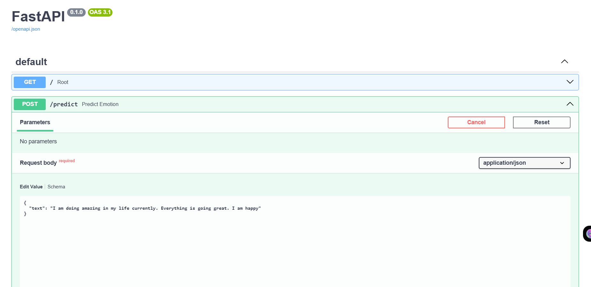
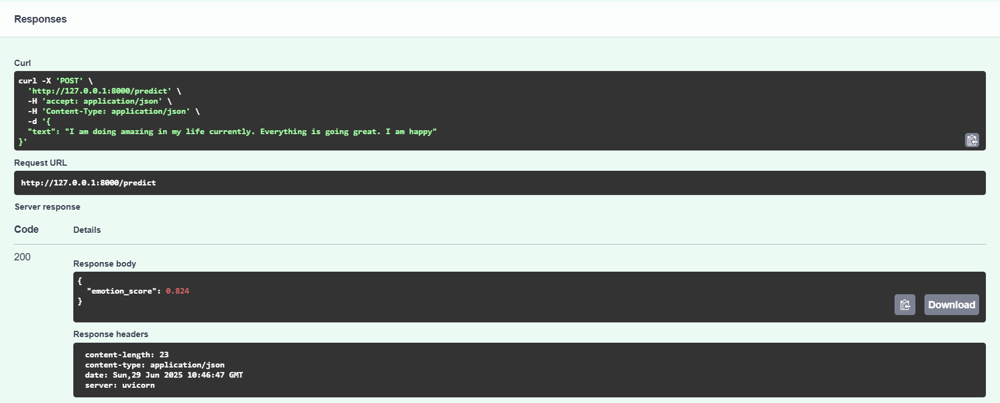
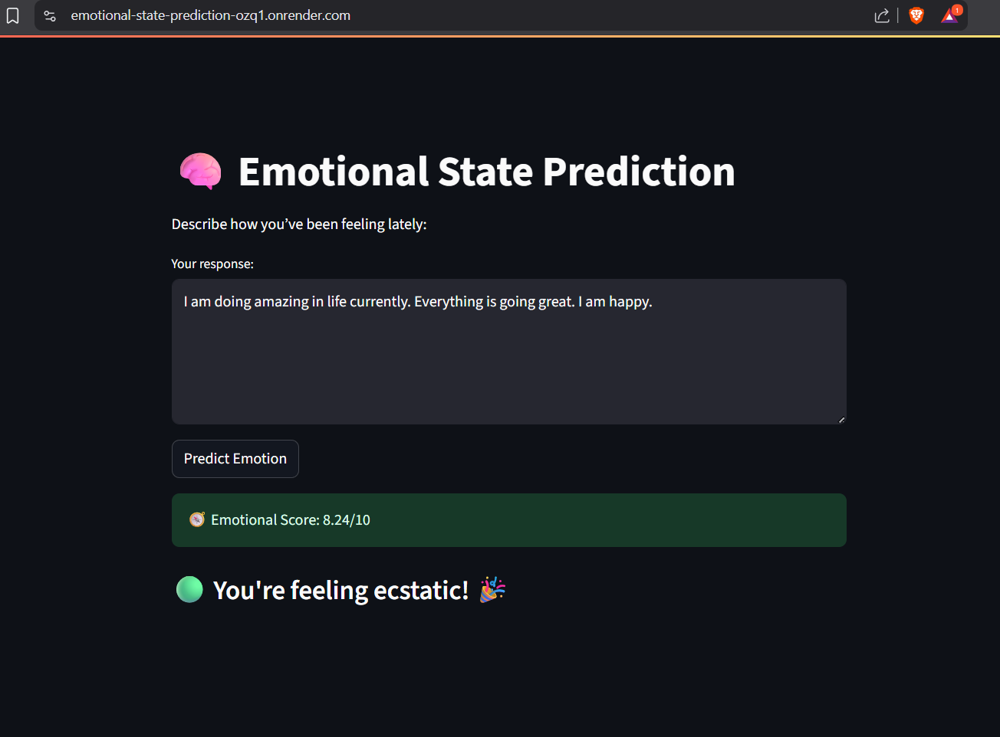
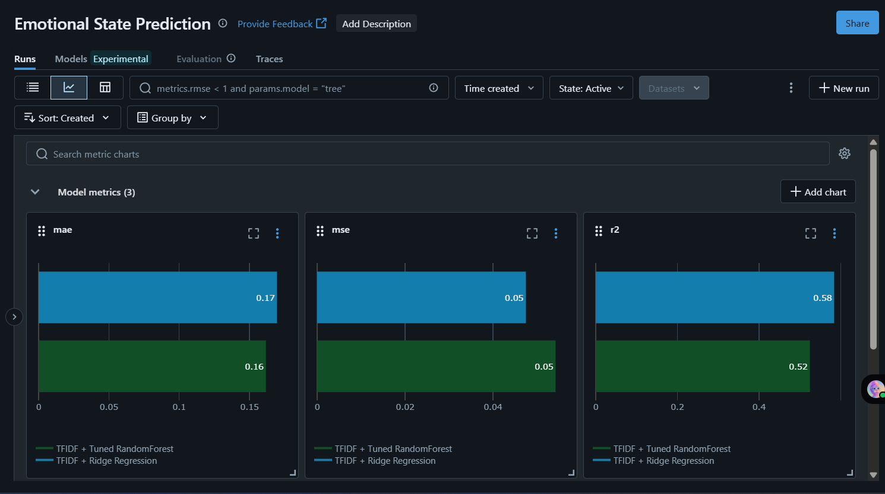

# Emotional State Prediction App

Predict the emotional wellbeing score of a user from natural language input, using a regression model trained on Reddit posts. The model outputs a continuous score from **0.0 (distressed)** to **1.0 (happy)** and is served through a full-stack application with a **FastAPI backend** and **Streamlit frontend**, fully containerized and deployed using **Docker** on **Render**.


&nbsp;
## <u>Live website</u>

[Click here to try the app](https://emotional-state-prediction-ozq1.onrender.com)

&nbsp;
## Objective

> To build a real-time application that quantifies a user's emotional state from open-ended text, using posts scraped from emotionally themed Reddit subreddits as training data.

&nbsp;
## Key Features

- **Regression-based emotional scoring** on a 0–10 scale
- **Reddit scraping via PRAW** to collect real-world emotional language
- **Text preprocessing pipeline** with cleaning, tokenization, and stopword removal
- **TF-IDF + Random Forest Regressor**, trained with hyperparameter tuning
- **MLflow logging** for model tracking, metrics, and reproducibility
- **FastAPI backend** to serve predictions via REST API
- **Streamlit frontend** for user interaction
- **Dockerized** app running both backend and frontend in a single container
- **Deployed on Render** with one-click access — no local setup needed

&nbsp;
## How to run locally

Make sure you have docker installed

```bash
git clone https://github.com/yourusername/emotional-state-predictor.git
cd emotional-state-predictor
docker build -t emotion-app
docker run -p 8000:8000 -p 8501:8501 emotion-app
```

Then visit:
- http://localhost:8000/docs (fastAPI docs): to test the fastAPI backend using Swagger UI
- http://localhost:8501 : Streamlit app

&nbsp;
## Web Scraping with PRAW

Data is collected using the PRAW (Python Reddit API Wrapper) library.
Subreddits were selected to reflect a wide emotional spectrum, and each scraped post is automatically labeled with a corresponding emotion_score.

#### Highlights:

- Secure credentials via .env
- Filters out low-quality posts using submission.score > 1
- Captures both title and selftext
- Outputs are stored as .csv for further processing

&nbsp;
## Dataset:

Reddit posts were scraped using the PRAW API from emotionally representative subreddits (e.g., r/SuicideWatch, r/happy, r/offmychest). Each subreddit was assigned a continuous emotional score label between 0.0 (distressed) and 1.0 (happy)

| Emotional Score | Subreddit         | Description                                     | Number of posts scraped|
| --------------- | ----------------- | ----------------------------------------------- |------------------------|
| 1.0             | r/gratitude       | Deep peace, appreciation, and life satisfaction |323                     |
| 0.9             | r/happy           | General happiness and positivity                |363                     |
| 0.8             | r/TodayIAmHappy   | Light-hearted daily positive reflections        |498                     |
| 0.7             | r/BenignExistence | Calm introspection, quiet existence             |489                     |
| 0.6             | r/Emotions        | Mixed feelings, emotional awareness             |304                     |
| 0.4             | r/offmychest      | Personal venting and emotional release          |263                     |
| 0.3             | r/vent            | Raw expressions of anger, sadness, stress       |308                     |
| 0.2             | r/lonely          | Isolation, longing, and social emptiness        |372                     |
| 0.1             | r/Anxiety         | Panic, worry, and helplessness                  |245                     |
| 0.0             | r/SuicideWatch    | Mental health crisis and suicidal ideation      |456                     |

&nbsp;
## How the Model Works
This project frames emotional analysis as a regression problem, predicting a continuous score rather than a categorical label (happy vs unhappy)

### Input Processing
- Text is cleaned (lowercased, stripped of URLs, emojis, punctuation, stopwords).
- The title and body (selftext) of Reddit posts are merged.
- Cleaned text is converted into a numerical vector using TF-IDF.

### Regression
- The model is a Random Forest Regressor trained to map TF-IDF vectors to a float between 0.0 and 1.0.
- Labels are derived from subreddit-based emotional scores.
- The model is tuned via GridSearchCV and evaluated using:
    - MSE (Mean Squared Error)
    - MAE (Mean Absolute Error)
    - R² Score
A Ridge Regression baseline is also included for comparison.

### Output
- Scores are clipped to stay within [0.0, 1.0]
- The FastAPI backend returns the score as JSON
- The Streamlit frontend converts the score into:
    - A 0–10 scale
    - An emoji + feedback statement

&nbsp;
## FastAPI Backend
The model is served using a FastAPI application (src/predict_api.py), which:
    - Loads the trained model and vectorizer from .pkl files
    - Preprocesses user input using the same cleaning pipeline
    - Exposes a /predict POST endpoint for emotional score prediction


&nbsp;
## Streamlit Frontend
The user-facing app (app.py) is built in Streamlit, allowing users to:
    - Enter a free-form journal-style text input
    - Submit to the backend via API
    - View score on a clean 0–10 scale
    - Get emotional feedback (color-coded + emoji)

&nbsp;
## MLflow Experiment Tracking
All model training runs (Ridge, Random Forest, etc.) are logged using MLflow, including:
- Hyperparameters
- Evaluation metrics (MSE, MAE, R²)
- Artifacts: serialized model and vectorizer
- Experiment comparison through the MLflow UI

&nbsp;
## Snapshots

#### FastAPI backend /docs
>
>

---
#### Streamlit Frontend
>

---

#### MLflow logs
>

---

&nbsp;
## Author
**Bishan Kumar Deka**
B.Tech, Chemical Engineering
IIT Guwahati